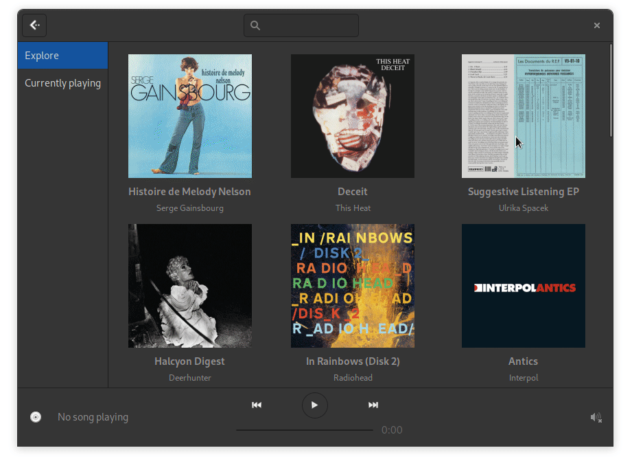

# Spot

Gtk/Rust native Spotify client for the Gnome desktop.

Based on [librespot](https://github.com/librespot-org/librespot/).

<a href='https://flathub.org/apps/details/dev.alextren.Spot'></a>




## Features

**Only works with premium accounts**

- minimal playback control (play/pause, prev/next, seeking)
- library browser (saved albums and playlists)
- album search
- artist view
- credentials management with Secret Service
- MPRIS integration

## Building

### With Gnome Builder

Should be as simple as opening the project and hitting run :)

### Manually

Requires Rust (stable), GTK3, and a couple other things. 

**Build** dependencies on Ubuntu 20.04 for instance: ```build-essential pkg-config meson libssl-dev libglib2.0-dev-bin libgtk-3-dev libasound2-dev libpulse-dev```. 

Also requires libhandy!!

Then, with meson:

```
meson target -Dbuildtype=debug -Doffline=false --prefix="$HOME/.local"
ninja -C target
```