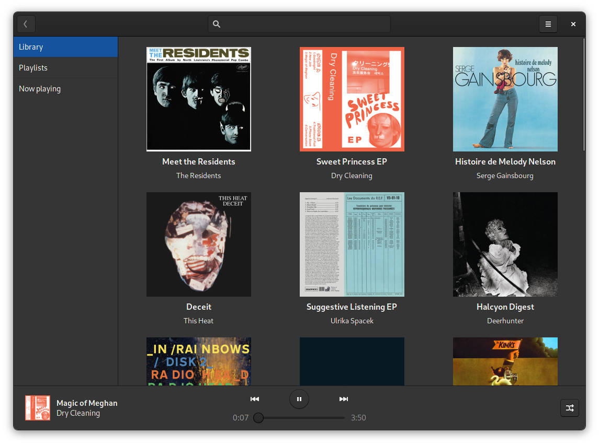

# Spot

Gtk/Rust native Spotify client for the GNOME desktop. **Only works with premium accounts!**

Based on [librespot](https://github.com/librespot-org/librespot/).



[Older demo gif](./demo.gif)

## Installing

| Package | Maintainer | Repo |
| ------- | ---------- | ---- |
| <a href='https://flathub.org/apps/details/dev.alextren.Spot'></a> | xou816 | https://github.com/flathub/dev.alextren.Spot |
| <a href='https://snapcraft.io/spot'></a> | popey | https://github.com/popey/spot-snap |
| <a href='https://aur.archlinux.org/packages/spot-client/'></a> | dpeukert | https://gitlab.com/dpeukert/pkgbuilds/tree/main/spot-client |


## Usage notes

### Credentials

It is recommended to install a libsecret compliant keyring application, such as [GNOME Keyring](https://wiki.gnome.org/action/show/Projects/GnomeKeyring) (aka seahorse). This will allow saving your password securely between launches.

In GNOME, things should work out of the box. It might be a bit trickier to get it working in other DEs: see this [ArchWiki entry](https://wiki.archlinux.org/index.php/GNOME/Keyring) for detailed explanations on how to automatically start the daemon with your session.

Bear special attention to the fact that to enable automatic login, you might have to use the same password for your user account and for the keyring, and that the keyring might need to be [set as default](https://wiki.archlinux.org/index.php/GNOME/Keyring#Passwords_are_not_remembered).

See [this comment](https://github.com/xou816/spot/issues/92#issuecomment-801852593) for more details!

### Settings

Spot can also be configured via `gsettings` if you want to change the audio backend, the song bitrate, etc. [A GUI is planned but not available yet.](https://github.com/xou816/spot/issues/142)

### Scrobbling

Scrobbling is not supported directly by Spot. However, you can use a tool such a [rescrobbled](https://github.com/InputUsername/rescrobbled) ([see #85](https://github.com/xou816/spot/issues/85)).

### Lyrics

Similarly, Spot does not display lyrics for songs, but you can use [osdlyrics](https://github.com/osdlyrics/osdlyrics)  ([see #226](https://github.com/xou816/spot/issues/226)).

### Gtk theme

Spot uses the dark theme variant by default; this can be changed using `gsettings`.

If you are using the flatpak version, don't forget to install your theme with flatpak as well -- even for Adwaita-dark!

See [this comment](https://github.com/xou816/spot/issues/209#issuecomment-860180537) for details.

## Features

**Only works with premium accounts!**

- playback control (play/pause, prev/next, seeking)
- play queue with shuffle option
- selection mode: easily browse and select mutliple tracks to queue them
- browse your saved albums and playlists
- search albums and artists
- view an artist's releases
- view users' playlists
- credentials management with Secret Service
- MPRIS integration

### Planned

- playlist management (creation and edition)
- liked tracks
- GNOME search provider?
- improved search? (track results, )
- recommendations?

## Contributing

Contributions are welcome! If you wish, add yourself to the `AUTHORS` files when submitting your contribution.

### Translating

Translations are managed using `gettext` and are available in the `po/` subdirectory.


**Before attempting to edit the potfiles manually, note that nice tools exist to help you work with them ([Poedit](https://poedit.net/) for instance).**

Otherwise, here is a rough overview of how to contribute translations:
- fork the repository;
- copy the `po/spot.pot` file and rename it to match your language code, or edit the relevant `po` file if it already exists;
- if needed, add your language code to `po/LINGUAS`;
- make sur the `Language` and `Plural-Forms` keys are correct;
- edit the `msgstr` entries;
- if you wish, add yourself to the `TRANSLATORS` file.

If you can't build Spot locally, you may run the `spot-snapshots` action against your branch from your Github fork (...I think?) to obtain a flatpak debug build.

## Building

### With GNOME Builder and flatpak

Pre-requisite: install the `org.freedesktop.Sdk.Extension.rust-stable` SDK extension with flatpak. Builder might do this for you automatically, but it will install an older version; make sure  the version installed matches the version of the Freedesktop SDK GNOME uses (at the time of writing: 20.08).

Open the project in GNOME Builder and make the `dev.alextren.Spot.development.json` configuration active. Then build :)

### Manually

Requires Rust (stable), GTK3, and a couple other things. Also requires libhandy1: it is not packaged on all distros at the moment, you might have to build it yourself!

**Build** dependencies on Ubuntu 20.04 for instance: ```build-essential pkg-config meson libssl-dev libglib2.0-dev-bin libgtk-3-dev libasound2-dev libpulse-dev```. 

Then, with meson:

```
meson target -Dbuildtype=debug -Doffline=false --prefix="$HOME/.local"
ninja install -C target
```

This will install a `.desktop` file among other things, and the spot executable will be put in `.local/bin` (you might want to add it to your path).

To build an optimized release build, use `-Dbuildtype=release` instead.

### Regenerating potfiles

When adding new `msgids`, don't forget to regenerate/update the potfiles.

```
ninja spot-pot -C target
ninja spot-update-po -C target
```

### Regenerating sources for flatpak

Using [flatpak-cargo-generator.py](https://github.com/flatpak/flatpak-builder-tools/tree/master/cargo):

```
ninja cargo-sources.json -C target
```

### Debugging

Debug builds (flatpak) are available from the master branch on Github (see the `spot-snaphots` action).

Spot caches images and HTTP responses in `~/.cache/spot`.

Spot uses [isahc](https://github.com/sagebind/isahc), which uses libcurl, therefore you can set the `https_proxy` env variable to help with debugging. In debug mode, Spot skips SSL certificate verification.